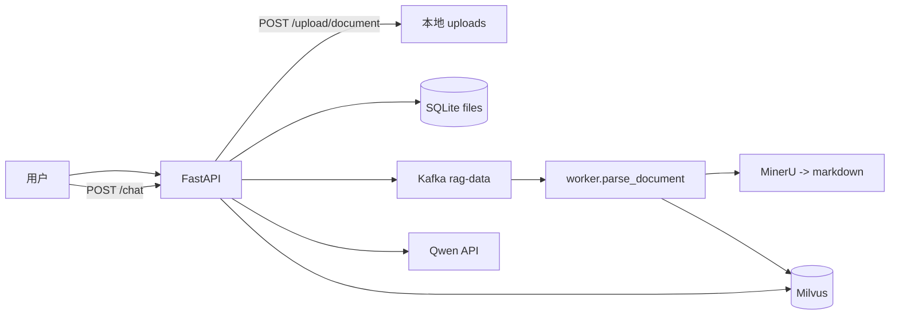

# 架构说明（初版）

## 数据流



## 分层

| 层 | 目录 | 职责 |
|----|------|------|
| 接口 | `app/routers/` | HTTP 契约、参数校验 |
| 应用 | `app/services/rag.py` | 编排检索 + 生成 |
| 领域 | `app/ingestion/` | 切块、路径重写 |
| 基础设施 | `app/services/retrieval.py`, `queue.py`, `storage.py` | Milvus/Kafka/SQLite |
| 离线 | `worker/parse_document.py` | 长耗时解析 |

## 运行方式

```bash
# API（默认 stub，无需 GPU/Milvus）
pip install -r requirements.txt
pytest tests/ -q
uvicorn app.main:app --reload --port 8000

# 生产：设置环境变量后关闭 stub
export MILVUS_URI=...
export MILVUS_TOKEN=...
export DASHSCOPE_API_KEY=...
export USE_STUB_EMBED=0 USE_STUB_CHAT=0 USE_STUB_VECTOR=0

# Worker（独立进程）
python -m worker.parse_document
```

## 与 Streamlit 的关系

- `web_demo.py` / `web_page_*.py`：演示 UI，逻辑与 API 平行。
- 新功能优先落在 `app/`，Streamlit 可改为调用 HTTP API（后续）。
